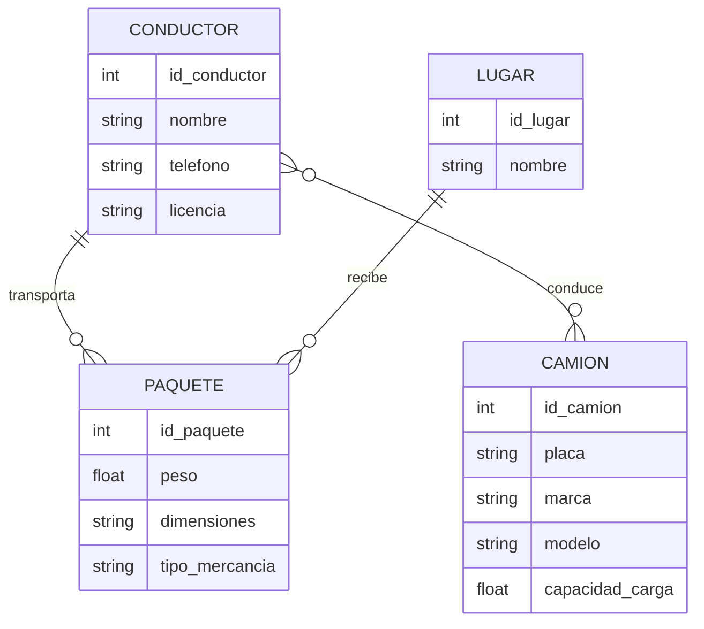

# Modelo ER Transporte

```mermaid
erDiagram

    CONDUCTOR {
        int id_conductor
        string nombre
        string telefono
        string licencia
    }

    CAMION {
        int id_camion
        string placa
        string marca
        string modelo
        float capacidad_carga
    }

    LUGAR {
        int id_lugar
        string nombre
    }

    PAQUETE {
        int id_paquete
        float peso
        string dimensiones
        string tipo_mercancia
    }

    CONDUCTOR ||--o{ PAQUETE : transporta

    CONDUCTOR }o--o{ CAMION : conduce

    LUGAR ||--o{ PAQUETE : recibe
```
